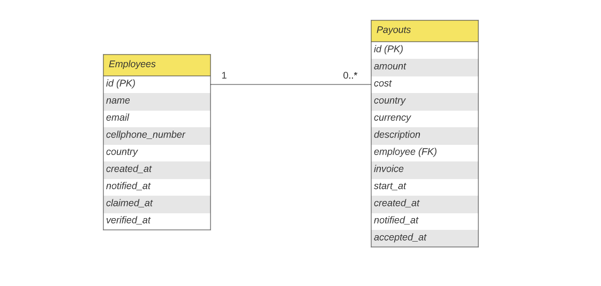
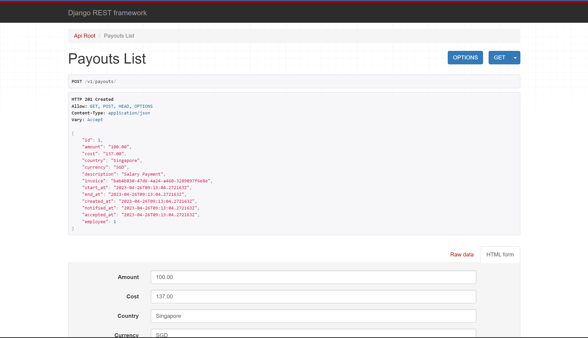

# MegaPay
MegaPay is a simple Django REST API deployed in Heroku.
This mini API allows organizations to create employees and their respective payouts to store data.

<a href="https://megapay.herokuapp.com/v1/" target="_blank"><strong>Check out the API »</strong></a>

## Built with
- [Django](https://www.djangoproject.com/)
- [Django REST Framework](https://www.django-rest-framework.org/)
- [PostgreSQL](https://www.postgresql.org/)

## Entity Relationship

## Preview

